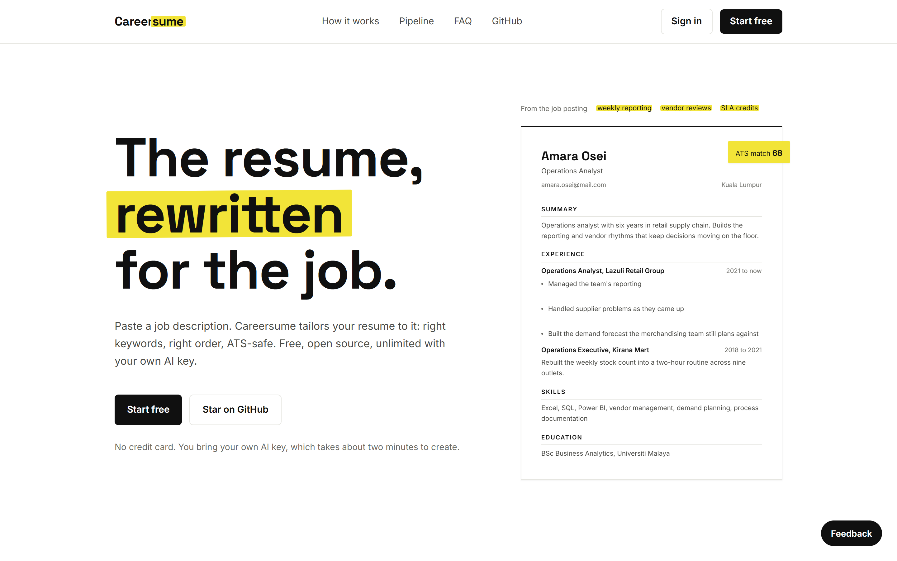
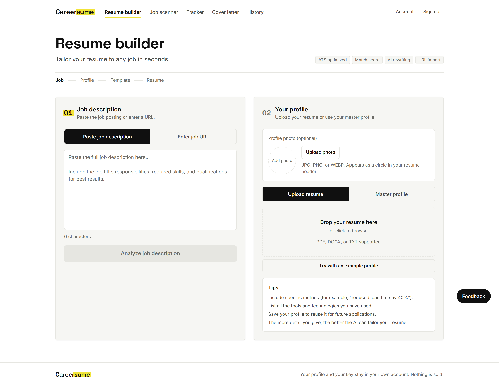

# Careersume

Paste a job description, get a resume rewritten for that job. Free, open source, and it runs on an AI key you own.

[](LICENSE)
[](https://nextjs.org)
[](CONTRIBUTING.md)



## Why Careersume

Open source already has good resume builders, and it has good developer-facing tailoring harnesses. What it has not had is the whole job-hunt loop in one app a non-developer would enjoy using: read the posting, tailor the resume against it, score the result before you send it, draft the matching cover letter, then track the application through to the reply. Careersume is that loop. Every AI call runs on a key you create and own, so there is no metered plan sitting in the middle of your job hunt, and the code is MIT, so if you would rather trust nobody you can run the whole thing yourself tonight.



## Features

The loop, in order:

- **Scan a posting.** Paste a job description or hand it a URL, and it pulls out the title, the responsibilities, and the keywords the role is really asking for.
- **Tailor the resume.** Your master profile gets rewritten against that specific posting: right keywords, right emphasis, ATS-safe structure. Output streams as it is written.
- **Score before you send.** Keyword coverage against the actual posting, with the gaps called out so you can fix them.
- **Draft the cover letter.** Written from the same profile facts as the resume, so the two documents agree with each other.
- **Track the application.** Every job, stage, and follow-up in one list instead of a spreadsheet you stop updating in week two.

Underneath all of it:

- **Bring your own key.** Gemini, Groq, OpenAI, or Anthropic. One key, connected once in the onboarding wizard, validated live against the provider before it is saved.
- **Your data stays yours.** Profile, documents, and key live in your own account behind Postgres row-level security. Nothing is sold, nothing trains anything, and your key is never sent to the browser. Resume files are parsed in your browser, so the file itself is never uploaded; only the text you approve is sent.

## How is it free?

There is no paid tier waiting at the end of this. The app costs nothing to run because it never pays an AI bill: you connect your own provider key, and every generation runs on that.

- **The key is free too.** A [Google AI Studio](https://aistudio.google.com/apikey) key takes about two minutes, needs no credit card, and its free tier comfortably covers a job hunt. Groq, OpenAI, and Anthropic keys work the same way if you already have one.
- **No artificial caps.** No credits, no three-a-month wall. Your own provider quota is the only limit. Two helper endpoints that scrape and search on the server do carry a quiet daily cap, since those cost the host rather than you. Resume generation itself is never capped.
- **MIT licensed.** Read it, fork it, ship it inside something else. See [Self-hosting](#self-hosting) if you want your own copy with your own database.

## Self-hosting

About a minute of typing, plus a Supabase project.

**Prerequisites:** Node 20 or newer, and a Supabase project (the free tier is fine).

```bash
git clone https://github.com/ahnafthaqeef/careersume.git
cd careersume
npm install
cp .env.example .env.local
```

Fill in the four required variables in `.env.local`, plus one optional fifth:

| Variable | What it is |
| --- | --- |
| `NEXT_PUBLIC_SUPABASE_URL` | Your Supabase project URL, from Project Settings then API. |
| `NEXT_PUBLIC_SUPABASE_ANON_KEY` | The public anon key for the same project. Safe to expose in the browser. |
| `SUPABASE_SERVICE_ROLE_KEY` | Server-only key used by the API routes. Never expose this to the client. |
| `BYOK_ENCRYPTION_KEY` | Secret that encrypts users' AI keys at rest. Generate with `openssl rand -base64 48`. Rotating it invalidates every saved key. |
| `JSEARCH_API_KEY` | Optional. A RapidAPI key for JSearch, used only by the job scanner's search box. Leave it unset and search is disabled with a notice, while everything else works. |

No AI provider keys go in the environment. Those belong to users, not to the server.

Then open the Supabase SQL editor and run these six files **in this order**:

1. `supabase_core.sql`, the per-user profile row plus the resume, cover letter, and ATS boost logs.
2. `supabase_byok_keys.sql`, encrypted per-user provider keys with row-level security.
3. `supabase_user_profiles.sql`, the master profile, one row per user.
4. `supabase_usage_counters.sql`, daily caps for the two helper endpoints that scrape and search.
5. `supabase_job_tracker.sql`, saved applications and the stage each one is at.
6. `supabase_feedback.sql`, in-app bug and idea reports, readable only by an admin.

The order matters: the feedback policy and the resume log both reference tables that `supabase_core.sql` creates. The seventh file in the repo, `supabase_history_migration.sql`, is not part of this list. It only backfills databases created before history persistence landed, and a fresh install already has everything it adds.

```bash
npm run dev
```

The app comes up on [http://localhost:3001/careersume](http://localhost:3001/careersume). Register an account, connect an AI key at `/careersume/onboarding`, and you are running your own Careersume.

The `/careersume` prefix is there because the hosted copy lives on a subpath of a larger site. If you are putting this at the root of your own domain, delete the `basePath` line from `next.config.ts` and the app moves to `/`; everything else follows automatically, because internal URLs are all built from that one setting.

### Deploying

Any Node host will do: `npm run build`, then `npm start`.

The first-class path is Cloudflare Workers, through the OpenNext adapter. `wrangler.jsonc` is in the repo with `nodejs_compat` already set, and `npm run deploy:cf` builds and ships in one step. Its `routes` entry claims `univa.my/careersume*` and nothing else on that zone, which is the deployment `basePath` is set up for; point it at your own hostname, and drop `basePath` if you are serving from the root. Put production secrets in with `wrangler secret put NAME`, and keep local Workers-runtime secrets in `.dev.vars`, copied from `.dev.vars.example`. It fits the Workers free plan: the Worker is comfortably under the 3 MB compressed limit, resume files are parsed in the browser rather than on the server, and no request does enough work to trouble the free tier's CPU budget.

## Architecture

```
src/
  app/
    page.tsx           landing page
    onboarding/        BYOK key wizard, the gate into the app
    builder/           job to profile to template to resume
    job-scanner/       read a posting from a URL
    cover-letter/      letter drafted from the same profile facts
    job-tracker/       applications and their stages
    api/               route handlers: generate-resume, analyze-job, byok, ...
  lib/
    ai.ts              facade: resolves the signed-in user's key, streams from their provider
    providers/         one adapter per provider (gemini, groq, openai, anthropic) plus the registry
    byok.ts            encrypt, store, read, and delete user keys
    parse-resume-file.ts  PDF/DOCX/TXT to text, in the browser, never uploaded
    prompts.ts         the tailoring and scoring prompts
    templates.ts       resume template definitions
```

Adding a provider means writing one adapter in `src/lib/providers/` and listing it in `index.ts`. Everything above the facade stays untouched.

**Key handling.** A user's provider key is encrypted with AES-256-GCM before it is written to Postgres, under a 32-byte key derived from `BYOK_ENCRYPTION_KEY` via HKDF-SHA256. It is decrypted on the server for the life of a single request and never leaves it, so the browser never sees the plaintext key. See [SECURITY.md](SECURITY.md) for the full model and how to report a vulnerability.

## Contributing

Contributions are welcome, including small ones. [CONTRIBUTING.md](CONTRIBUTING.md) covers the dev setup, the commands, and the house conventions.

Looking for a first issue? **Dark mode** is the canonical one: the design tokens already live in `tailwind.config.ts`, so it is a real self-contained piece of work rather than a chore. It and other approachable tasks are labelled [`good-first-issue`](https://github.com/ahnafthaqeef/careersume/labels/good%20first%20issue).

## Credits

Built with [Next.js](https://nextjs.org), [Tailwind CSS](https://tailwindcss.com), and [Supabase](https://supabase.com).

Two adjacent open-source projects worth knowing if you are in this space: [Reactive Resume](https://github.com/AmruthPillai/Reactive-Resume) for resume building and design, and [Resume-Matcher](https://github.com/srbhr/Resume-Matcher) for resume to job-description matching.

## License

[MIT](LICENSE). Copyright (c) 2026 Ahnaf Thaqeef.
